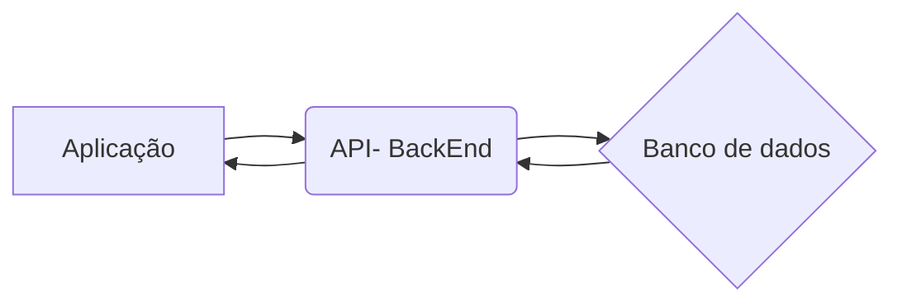

 
<h1>EBYRT PROJECT🚀 <h1/>
	SEJA MUITO BEM VINDX! 

### SOBRE

#### *EBYRT PROJECT* é um projeto FullStack,  realizado principalmente com React.js e Node.js. O objetivo foi desenvolver uma aplicação web, que possui funcionalidades de gestão de atividades, ou seja,  é uma aplicação que permite criar, editar, excluir tarefas, estas, as quais possuem status e  que definem a "urgência" para realizar tal tarefa. A explicação completa e mais detalhada poderá ser encontrada na seção detalhes do projeto.

## TABELA DE CONTEÚDOS

<!--ts-->
* [Trybe](#trybe)
* [Estrutura GitHub](#estrutura-do-projeto-no-github)
  * [FrontEnd](#frontend)
  * [BackEnd](#backend)
* [Detalhes do Projeto](#detalhes-do-projeto)
  * [Case](#case)
    * [Requisitos Técnicos](#requisitos-técnicos)
    * [Funcionalidades](#funcionalidades)
  * [Desenvolvimento](#desenvolvimento)
	   * [Como Foi Feito](#como-foi-feito)
	   * [Imagens](#imagens)
* [Softwares Utilizados](#softwares-e-ferramentas-utilizadas)
 * [Como Instalar](#como-instalar)
* [Sobre Mim](#)
<!--te-->
	

## TRYBE
#### Quer conhecer mais sobre a [TRYBE](https://www.betrybe.com/)?  Dê uma olhadinha neste link a seguir:

## ESTRUTURA DO PROJETO NO GITHUB
#### Este repositório em duas partes, a de frontend, e a parte de backend, para entender um pouco melhor basta clicar sobre cada pasta no topo desta página ou em algum dos links logo aqui abaixo, que você será redirecionado para cada pasta do projeto.

#### [FRONTEND](https://github.com/fabiojuvenalpereira/EbytrProject/tree/main/frontend)
#### [BACKEND](https://github.com/fabiojuvenalpereira/EbytrProject/tree/main/backend)

## DETALHES DO PROJETO

### CASE
	
#### REQUISITOS TÉCNICOS
* Front-End em **React**;
*  Back-End em **NodeJS**, com **MongoDB**;
*  Arquitetura em **camadas**;

#### FUNCIONALIDADES
*  Visualizar a lista de tarefas;
	*  Esta lista deve ser ordenável por ordem alfabética, data de criação ou por status;
*  Inserir uma nova tarefa na lista;
*  Remover uma tarefa da lista;
*  Atualizar uma tarefa da lista;
*  A tarefa deve possuir um status editável: pendente, em andamento ou pronto;
 
### DESENVOLVIMENTO

#### COMO FOI FEITO

#### IMAGENS

## SOFTWARES E FERRAMENTAS UTILIZADAS
- [Npm](https://www.npmjs.com/) - É um gerenciador de pacotes para o Node.JS npm, Inc. é uma subsidiária do GitHub, que fornece hospedagem para desenvolvimento de software e controle de versão com o uso do Git. npm é o gerenciador de pacotes padrão para o ambiente de tempo de execução JavaScript Node.js

- [Visual Code Studio](https://code.visualstudio.com/) - O Visual Studio Code é um editor de código-fonte desenvolvido pela Microsoft para Windows, Linux e macOS. Ele inclui suporte para depuração, controle de versionamento Git incorporado, realce de sintaxe, complementação inteligente de código, snippets e refatoração de código.  [1.64.2]

- [Node.js]((https://nodejs.org/)) - Node.js é um software de código aberto, multiplataforma, baseado no interpretador V8 do Google e que permite a execução de códigos JavaScript fora de um navegador web. [14 ou superior].

- [Insomnia](https://insomnia.rest/download) - É uma ferramenta cliente de API REST, que tem a capacidade de realizar requisições http. Ela foi desenvolvida para facilitar os testes e design de APIs REST. [2021.7.2]
- [Git](https://git-scm.com/downloads) - É um sistema de controle de versões distribuído, usado principalmente no desenvolvimento de software, mas pode ser usado para registrar o histórico de edições de qualquer tipo de arquivo.
- [GitHub](https://github.com/) - é uma plataforma de hospedagem de código-fonte e arquivos com controle de versão usando o Git. Ele permite que programadores, utilitários ou qualquer usuário cadastrado na plataforma contribuam em projetos privados e/ou Open Source de qualquer lugar do mundo.

## COMO INSTALAR

Para conseguir instalar e fazer com que o código rode no seu computador, você vai precisar seguir alguns
requisitos.

Primeiro você precisará de ter os softwares utilizados para criar instalados em sua máquina, mas não se preocupe você poderá encontrá-los na seção de softwares e ferramentas utilizadas, que é esta [aqui](#softwares-e-ferramentas-utilizadas). As versões dos softwares que utilizei, estão logo ao final da síntese, contidas entre colchetes assim como neste exemplo: **[1.64.2]**.

Tendo os softwares instalados em sua  máquina você precisará realizar os seguintes passos
####
	git clone git@github.com:fabiojuvenalpereira/EbytrProject.git

## COMO FUNCIONA
#####  Desenho simbólico do armazenamento de dados realizado no banco de dados:
| _id |userName |task                   | date                  |
|-----|---------|-----------------------|-----------------------|
| 1   | Xablau  | Beber água            | 14/02/2022 - 14:00:01 | 
| 2   | Xablau 	| Terminar a série      | 14/02/2022 - 14:50:00 | 

##

##### Simbolização da rota realizada pela aplicação:

##
#### Os links abaixo contém alguns sites e fóruns, que podem ser interessantes para pessoas que estão iniciando na área de desenvolvimento.
- [Trybe](https://www.betrybe.com/)
- [HackerRank](https://www.hackerrank.com/)
- [Mozila ](https://developer.mozilla.org/pt-BR/docs/Web/JavaScript) 
- [Fórum Stack Overflow](https://stackoverflow.com/) 
- [w3schools](https://www.w3schools.com/jsref/default.asp)

##

	<a href="https://www.linkedin.com/in/fabiojuvenalpereira/">Linkedin</a>
	<a href="https://github.com/fabiojuvenalpereira">GitHub</a>
	<a href="mailto:fabiojuvenalpereira@gmail.com">Email:</a> fabiojuvenalpereira@gmail.com

